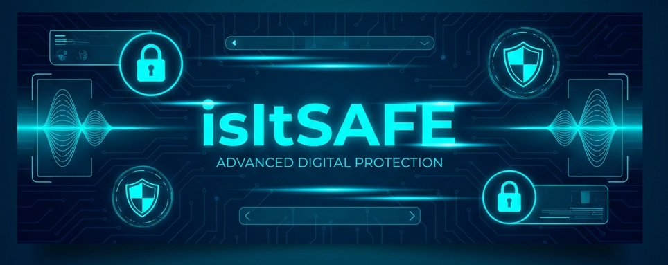

<div align="center">



# 🛡️ isItSAFE - Unified Security Suite
### *Ultimate Protection Suite for your Digital Life*

[](https://www.python.org/downloads/)
[](Data/LICENSE)
[]()

</div>

---

## 🚀 Overview
**isItSAFE** is a comprehensive, all-in-one security toolkit designed to empower users with advanced protection tools. From monitoring wireless networks to analyzing suspicious links and cleaning sensitive file metadata, isItSAFE provides a unified interface for modern digital defense.

## 🛠️ Core Modules

### 📡 WiFi Security Monitor
*Detect and prevent Evil Twin attacks in real-time.*
- **Intrusion Detection**: Actively scans for suspicious Access Points (APs).
- **History Tracking**: Maintains a database of known-safe networks.
- **Alert System**: Immediate notifications when a potential "Evil Twin" is detected.

### 🔍 URL Detector
*Heuristic and AI-driven analysis for phishing URLs.*
- **Phishing Detection**: Uses advanced heuristics to identify malicious links.
- **Domain Analysis**: Inspects TLDs and suspicious subdomains.
- **Safety Reports**: Provides a clear verdict on whether a link is safe to click.

### 🖼️ Metadata Cleaner
*Strip sensitive hidden data from your files.*
- **EXIF Removal**: Cleans GPS coordinates, camera details, and timestamps from images.
- **Document Scrubbing**: Removes author info and revision history from PDF and DOCX files.
- **Privacy First**: Ensures your shared media doesn't leak personal information.

---

## 💻 Tech Stack
- **Core Logic**: Python 3.x
- **GUI Framework**: Tkinter / Custom Modern Theme
- **Libraries**:
  - `tldextract` (URL Parsing)
  - `Pillow` (Image Processing)
  - `PyPDF2` & `python-docx` (Metadata Extraction)
  - `sqlite3` (WiFi History Database)

---

## ⚙️ Installation & Setup

### 1. Prerequisites
Ensure you have Python 3.8 or higher installed on your system.

### 2. Clone the Repository
```bash
git clone https://github.com/MBilal26/isItSAFE.git
cd isItSAFE
```

### 3. Quick Setup (Via GUI)
Launch the main application and click the **"INITIAL SETUP: INSTALL DEPENDENCIES"** button.
```bash
python isItSafe.py
```

### 4. Manual Installation
If you prefer the command line:
```bash
pip install -r Data/requirements.txt
```

---

## 📖 Usage
Run the central hub to access all modules from a single dashboard:
```bash
python isItSafe.py
```
From the dashboard, you can launch individual modules like the **WiFi Scanner**, **URL Detector**, or **Metadata Cleaner** with a single click.

---

## 🤝 Contributors
Developed with ❤️ by:
- **USAID**
- **BILAL**
- **SHADAN**
- **AYAN**

---

<div align="center">
  <sub>Ask your self isItSafe?. </sub>
</div>
